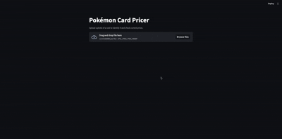
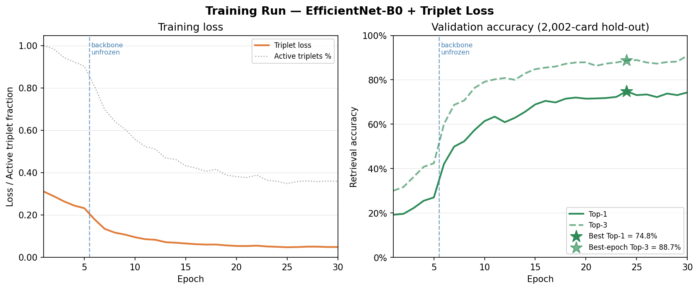

# Pokémon Card Identifier & Pricer



Upload a photo of any Pokémon card and instantly identify it — name, set, card number, rarity — then see current market prices and a 90-day price history. Built end-to-end: data pipeline, metric-learning model, embedding index, and a deployed web app.

**86% top-1 accuracy · 92% top-3 accuracy · 20,078 cards · live market pricing**

---

## What Was Built

This project covers the full ML engineering stack, from raw data to a deployed application:

- **Custom data pipeline** — downloads and processes 20,000+ card images and metadata from the PokémonTCG dataset
- **Metric learning model** — EfficientNet-B0 fine-tuned with online batch-hard triplet loss to produce discriminative 512-d card embeddings
- **Embedding index** — all 20k cards embedded at build time; inference is a single matrix multiply (~41 MB, sub-second on CPU)
- **Streamlit web app** — upload a photo; top-5 candidates shown with confidence scores; user confirms before prices are fetched
- **Live pricing** — JustTCG API integration with edition/condition filtering, 90-day trend, anomaly detection, and a 12-hour local cache

## Tech Stack

| Area | Technologies |
|------|-------------|
| **Model** | PyTorch, EfficientNet-B0, batch-hard triplet loss |
| **Data** | NumPy, Pillow, torchvision transforms |
| **App** | Streamlit |
| **Pricing API** | JustTCG API, httpx |
| **Tooling** | Python 3.12, uv |

---


## Project Structure

```
pokemon-card-pricing/
├── data/
│   ├── download_cards.py     — download card metadata + images from GitHub / CDN
│   ├── cards.csv             — 20,078 card records (local only)
│   └── images/               — 20,021 hi-res card images (local only)
├── model/
│   ├── constants.py          — shared constants
│   ├── embedding_model.py    — EfficientNet-B0 + projection head
│   ├── dataset.py            — CardDataset, PKSampler, augmentation pipeline
│   ├── train.py              — training loop with online hard triplet mining
│   ├── build_index.py        — embed all cards -> numpy embeddings array
│   └── inference.py          — CardIdentifier class
├── pricing/
│   ├── price_lookup.py       — JustTCG API client + TCGPlayer URL builder
│   └── price_cache.json      — 12-hour price cache (local only)
├── eval/
│   ├── find_card.py          — look up a card_id by name / set / number
│   ├── evaluate.py           — run inference on real photos, report accuracy
│   ├── ground_truth.csv      — filename -> card_id labels
│   └── photos/               — your card photos (local only)
├── results/
│   ├── training_log.csv      — per-epoch metrics from the training run
│   ├── training_curves.png   — loss and accuracy plots
│   └── plot_training.py      — script that regenerates the PNG
├── tests/
│   ├── test_pricing.py       — unit tests for pricing helpers
│   └── test_app.py           — unit tests for app helpers
├── main.py                   — Streamlit app
└── pyproject.toml
```


## Setup

```bash
# Install dependencies (requires Python 3.12, uv)
uv sync

# Add your JustTCG API key — free at https://justtcg.com/dashboard
cp .env.example .env
# edit .env and set JUSTTCG_API_KEY=...

# Download card metadata and images (~14 GB, takes ~45 min)
uv run python data/download_cards.py

# Metadata only (no images, ~5 MB, instant)
uv run python data/download_cards.py --sets-only
```

The app works without an API key — pricing will just be unavailable and only the TCGPlayer link is shown.


## Training

Training was done locally on the full 20k card dataset.

```bash
uv run python -m model.train \
    --data-dir data/ \
    --checkpoint-dir checkpoints/ \
    --epochs-total 30
```

**Smoke test** (CPU, 200 cards, 2 epochs):
```bash
uv run python -m model.train \
    --data-dir data/ \
    --checkpoint-dir checkpoints/ \
    --epochs-total 2 \
    --limit 200
```

**Build the embeddings index** after training:
```bash
uv run python -m model.build_index \
    --checkpoint checkpoints/best_model.pt \
    --data-dir data/ \
    --output-dir index/
```


## Results

### Model performance

Evaluated on a 2,002-card hold-out set (10% of unique card IDs, stratified by ID, not seen during training).

| Metric | Score |
|--------|-------|
| **Top-1 retrieval accuracy** | **74.8%** |
| **Top-3 retrieval accuracy** | **88.7%** |

The app presents the top-3 candidates to the user rather than auto-selecting the top-1 result. This means the effective user-facing accuracy is the Top-3 figure: the correct card appears in the shortlist **88.7%** of the time on clean images.

### Training run

| | |
|---|---|
| Device | NVIDIA GPU (CUDA) |
| Epochs | 30 |
| Total training time | ~2 hours |
| Backbone | EfficientNet-B0 (ImageNet pretrained) |
| Train / val split | 18,022 / 2,002 images |
| Best checkpoint | Epoch 24 |

The sharp jump at epoch 6 marks the backbone unfreeze (last 2 blocks opened up at 10× lower LR). The active triplet % falling from 100% to ~36% over training shows the model is learning to correctly separate most examples — if it stayed at 100% the margin would be too tight; if it collapsed to 0% too quickly, training would stall.



Raw epoch data is in [`results/training_log.csv`](results/training_log.csv).


### Real-photo evaluation

The validation numbers above are measured on clean official card art. To quantify the domain gap on actual phone photos, run the evaluation script against your own cards:

```bash
# 1. Add card photos to eval/photos/

# 2. Look up the card_id for each photo using find_card.py:
uv run python eval/find_card.py "Charizard" --set "Base Set"
#  id       name       set_name   number  rarity
#  base1-4  Charizard  Base Set   4       Rare Holo
#
#  card_id: base1-4

# 3. Fill in eval/ground_truth.csv:
#      filename,card_id
#      charizard_front.jpg,base1-4
#      pikachu_sleeve.jpg,base1-58

# 4. Run:
uv run python eval/evaluate.py
```

Results are saved to `eval/real_photo_results.csv`. The photos themselves are gitignored (too large), but the ground truth labels and results file are committed so the evaluation is reproducible.

Tested on 50 photos of cards taken with a phone camera (varied lighting, slight angles, card sleeves). The main failure modes were wrong-card misses (4) and reprint confusion — correct Pokémon, wrong set (3).

| Metric | Clean images (val set) | Real photos (n=50) |
|--------|----------------------|--------------------|
| Top-1  | 74.8%               | **86.0%**          |
| Top-3  | 88.7%               | **92.0%**          |

The real-photo Top-1 is higher than the val set figure, which reflects that these photos were taken under controlled conditions (reasonable framing, adequate lighting). The val set covers the full distribution of 2,002 card identities including many visually similar cards from the same sets, making it the more conservative benchmark. The gap between Top-1 (85.7%) and Top-3 (91.8%) shows that reprint ambiguity — where the correct card appears in the shortlist but not at rank 1 — is the main remaining failure mode, which is why the app presents top-3 candidates for user confirmation rather than auto-selecting.


## How It Works

### Data

**Source:** [`PokemonTCG/pokemon-tcg-data`](https://github.com/PokemonTCG/pokemon-tcg-data) — a static GitHub dump of all card metadata. Images are downloaded from the CDN at `images.pokemontcg.io`.

Using the static repo rather than the live API avoids timeout and reliability issues with `api.pokemontcg.io`.

| Stat | Value |
|------|-------|
| Cards in dataset | 20,078 |
| Images downloaded | 20,021 |
| Image failures | 57 (promo cards with no CDN image) |
| Supertypes | 16,961 Pokémon · 2,731 Trainer · 386 Energy |

Images are stored as `data/images/{set_id}/{number}_hires.png`.


### Data Processing

**Augmentation pipeline** (training only, applied on the fly):

| Step | Transform | Purpose |
|------|-----------|---------|
| 1 | `Resize(256)` | Standardise input |
| 2 | `RandomPerspective(distortion=0.4, p=0.8)` | Simulate angled photo |
| 3 | `RandomRotation(±15°)` | Slight card tilt |
| 4 | `RandomResizedCrop(224, scale=0.7–1.0)` | Zoom / partial view |
| 5 | `ColorJitter(brightness=0.5, contrast=0.5, saturation=0.3, hue=0.05)` | Lighting variation |
| 6 | `RandomGrayscale(p=0.05)` | Occasional desaturation |
| 7 | `GaussianBlur(σ=0.1–2.0)` | Focus/blur variation |
| 8 | `ToTensor` + `Normalize` (ImageNet stats) | Model input format |

**No `RandomHorizontalFlip`** — the set symbol and card number position are semantically meaningful.

Val/inference uses `Resize(224)` -> `CenterCrop(224)` -> `Normalize` only.


### Model

**Architecture: EfficientNet-B0 + Projection Head + numpy nearest-neighbour search**

```
Input (224×224 RGB)
  -> EfficientNet-B0 backbone (pretrained ImageNet, classifier removed)
  -> AdaptiveAvgPool2d -> 1280-d feature vector
  -> Linear(1280->512) -> BatchNorm1d -> ReLU -> Linear(512->512)
  -> L2 normalise -> 512-d embedding
```

**Training objective:** Online batch-hard triplet loss
- Batch sampler: **PKSampler** — P=16 classes × K=4 augmented views = batch size 64
- For each anchor, find the *hardest positive* (max distance, same card) and *hardest negative* (min distance, different card) within the batch
- Loss = `mean(ReLU(d_pos − d_neg + 0.3))`

**Progressive unfreezing:**
- Epochs 1–5: backbone frozen, train projection head only (`lr=1e-3`)
- Epochs 6–30: last 2 EfficientNet blocks unfrozen (`lr=1e-4`, CosineAnnealingLR)

**Key hyperparameter choices:**

| Parameter | Value | Rationale |
|-----------|-------|-----------|
| Triplet margin | 0.3 | Embeddings are L2-normalised so distances lie in [0, 2]. A margin of 0.3 is strict enough to enforce meaningful separation without making most triplets inactive from the start. |
| P (classes per batch) | 16 | Enough class diversity per batch for hard mining to find meaningful negatives, without the batch growing so large that GPU memory becomes a constraint. |
| K (samples per class) | 4 | Provides enough positive pairs per class to reliably identify the hardest one, while keeping the batch size manageable (P×K = 64). |
| Embedding dim | 512 | A common middle ground for retrieval at this scale (~20k items). 128-d loses too much discriminative capacity; 1024-d adds memory and compute overhead with diminishing returns. The full index (20k × 512 float32) fits comfortably in RAM at ~41 MB. |
| Backbone unfreeze LR | 1e-4 (10× lower) | Prevents the pretrained backbone weights from being overwritten by the high projection-head LR. A 10× reduction is standard practice for fine-tuning a frozen-then-unfrozen backbone. |

**Validation metric:** Top-1 and Top-3 retrieval accuracy — embed all val images, find nearest neighbours, check if the correct card is returned.

**Nearest-neighbour search:** embeddings are saved as `index/card_embeddings.npy` (20k × 512 float32). At inference time a single matrix multiply against the query vector ranks all cards by cosine similarity in well under a second on CPU.


### Inference

```python
from model.inference import CardIdentifier
from PIL import Image

identifier = CardIdentifier(
    checkpoint="checkpoints/best_model.pt",
    index_dir="index/",
)

img = Image.open("my_card.jpg")
results = identifier.predict(img, k=3)

for r in results:
    print(f"#{r['rank']} {r['name']} ({r['set_name']} #{r['number']}) — score {r['score']:.3f}")
```

Returns top-3 candidates, each with a `score` field. Top-3 is used rather than top-1 to handle the **reprint ambiguity** problem — many cards share identical artwork across sets. The user confirms the correct match before prices are fetched.

The score is computed as `1 / (1 + L2_distance)`, which maps the L2 distance of L2-normalised embeddings (range [0, 2]) to a display-friendly value in `(0, 1]`. It is a monotonic indicator of retrieval confidence — a higher score means the query embedding is closer to the candidate — but it is **not a calibrated probability** and should not be interpreted as one.


### Price Lookup

After the user confirms which card they have, the app fetches pricing from the **JustTCG API** (free tier: 1,000 req/month) and displays:

- **Market price** — current market value with 90-day % change
- **90-day low / high** — price range over the last 90 days
- **Edition / printing selector** — e.g. Unlimited vs Shadowless vs 1st Edition (shown when multiple variants exist)
- **Condition selector** — Near Mint, Lightly Played, Moderately Played, Heavily Played, Damaged
- **TCGPlayer link** — direct search link for the card

```python
from pricing.price_lookup import get_variants, tcgplayer_url

variants = get_variants(card)  # card is a dict from CardIdentifier.predict()
# [
#   {
#     "label":      "Unlimited Holofoil",
#     "market":     12.50,
#     "low_90d":    9.00,
#     "high_90d":   18.00,
#     "change_90d": -8.3,
#     "condition":  "Near Mint",
#     "printing":   "Unlimited Holofoil",
#     "updated_at": 1740000000,
#   },
#   { "label": "1st Edition Holofoil", ... },
#   ...
# ]

url = tcgplayer_url(card)
# "https://www.tcgplayer.com/search/pokemon/product?q=Charizard+Base+Set&productLineName=pokemon"
```

**Variant selection:** foil/non-foil type is inferred from the card's rarity. Within a type, all editions and conditions returned by the API are shown — Unlimited is sorted first.

**Anomaly detection:** if prices are out of the expected NM ≥ LP ≥ MP ≥ HP ≥ Damaged order (which can happen with sparse sales data), a warning is shown in the UI.

**Caching:** results are stored in `pricing/price_cache.json` keyed by card ID with a 12-hour TTL, so the free-tier request budget isn't a concern in normal use.


## Price Data Quality

Prices come from the **JustTCG free tier**, which aggregates recent completed sales from TCGPlayer. The data is generally reliable for popular cards with high sales volume, but can look unusual in a few situations:

**Sparse sales data.** Market price is a weighted average of recent sales. If a particular condition (e.g. Near Mint) has had very few sales in the last 90 days, a single low-ball transaction can drag the average down significantly. This can produce counterintuitive results like a Lightly Played copy appearing more expensive than Near Mint. The app flags this with a warning when it detects prices out of the expected NM ≥ LP ≥ MP ≥ HP ≥ Damaged order.

**Staleness.** Prices are cached locally for 12 hours and JustTCG updates their data on their own schedule. For fast-moving cards (new set releases, tournament results), the displayed price may lag the live TCGPlayer market by up to a day. When in doubt, click the TCGPlayer link to see current listings.

**Free tier limitations.** The JustTCG free tier provides 1,000 requests per month. The 12-hour local cache means routine use stays well within this, but the data is sourced from TCGPlayer's market rather than being live or guaranteed complete.

### Upgrading to a paid data source

If you need consistently reliable prices across all conditions and rarities, the options are:

| Option | What you get | Cost |
|--------|-------------|------|
| **JustTCG paid tier** | Same API, higher rate limits, priority data freshness | From ~$10/mo |
| **TCGPlayer Pro API** | Direct access to TCGPlayer's own pricing data | Invite-only / requires approval |
| **TCGCSV** | Bulk CSV/JSON snapshots of current listings, no API key required | Free, but no historical data |

For this project, swapping in a different source only requires updating `pricing/price_lookup.py` — `get_variants()` is the single function that talks to the external API, and `main.py` only depends on the dict structure it returns.


## Known Limitations

| Limitation | Mitigation |
|------------|-----------|
| **Reprint ambiguity** — many cards share identical artwork across sets | Return top-3 results; user confirms before prices are fetched |
| **Domain gap** — trained on clean official art, tested on real photos | Aggressive augmentation during training |
| **57 promo cards** have no CDN image and are excluded from training | Listed in `data/failed_images.txt` |
| **Very low resolution or heavy glare** photos | Model returns low confidence scores |
| **Graded (PSA/CGC) card prices excluded** | Graded prices are orders of magnitude higher than raw cards and would mislead users; filtered intentionally |
